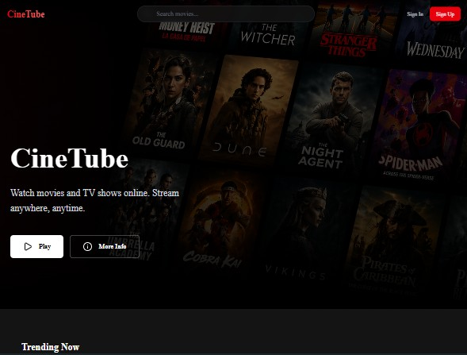

# 🚀 Asif Sheikh — Developer Portfolio

<div align="center">



**A cinematic, immersive portfolio built with Next.js 16, featuring a sci-fi intro sequence, an interactive solar system, and glassmorphic design.**

[](https://portfolio-v2-azure-chi.vercel.app/)
[](https://github.com/asif12018)
[](https://www.linkedin.com/in/mdasifsheikh-2000diu)
[](https://x.com/AsifIsl80020757)

</div>

---

## ✨ Features

### 🎬 Cinematic Intro Sequence
- Sci-fi HUD text animation before the site loads (`WELCOME, ASTRONAUT.`)
- Seamless transition into a full-screen intro video (`/public/intro.mp4`)
- Plays **once per browser session** via `localStorage`
- Skip button available at all times

### 🪐 Interactive Solar System Background
- Canvas-based solar system with a glassy central **Sun**
- **9 orbiting planets** each representing a skill in the tech stack:
  - React, Next.js (inner orbit)
  - TypeScript, JavaScript (second orbit)
  - Node.js, Express (third orbit)
  - PostgreSQL, Prisma, Tailwind CSS (outer orbit)
- Hover over any planet to see the skill name tooltip
- Smooth **mouse parallax** effect across all elements

### 🚀 Rocket Scroll Indicator
- A glowing rocket on the right side of the screen tracks scroll progress
- Dynamically **flips direction** and fires thrusters when scrolling up vs. down

### 🎨 Design & UI
- **Glassmorphic** cards and UI elements (iOS-style `backdrop-blur`)
- Custom animated cursor (hides the default OS cursor)
- Scroll progress bar at the top of every page
- Smooth scrolling via **Lenis**
- Responsive on all screen sizes

### 📄 Pages

| Page | Description |
|------|-------------|
| `/` | Hero section with interactive solar system, CTA buttons, and social links |
| `/projects` | Project cards with a glowing **⭐ Best Project** badge on CineTube |
| `/projects/[id]` | Detailed project view with tech stack, live/GitHub links, challenges |
| `/about` | Bio, skills, education, and a live contact form |
| `/contact` | Standalone contact form powered by **EmailJS** |

---

## 🛠️ Tech Stack

| Category | Technologies |
|----------|-------------|
| **Framework** | Next.js 16 (App Router) |
| **Language** | TypeScript |
| **Styling** | Tailwind CSS v3 |
| **Animation** | Framer Motion, GSAP + ScrollTrigger |
| **Smooth Scroll** | Lenis |
| **Email** | EmailJS (`@emailjs/browser`) |
| **Rendering** | Interactive Canvas 2D API (Solar System) |
| **Deployment** | Vercel |

---

## 🚀 Getting Started

### Prerequisites
- Node.js `>= 18`
- npm or yarn

### Installation

```bash
# 1. Clone the repository
git clone https://github.com/asif12018/portfolio-v2.git
cd portfolio-v2

# 2. Install dependencies
npm install

# 3. Set up environment variables
# Create a .env file in the root directory:
```

```env
NEXT_PUBLIC_EMAILJS_TEMPLATE_ID="your_template_id"
NEXT_PUBLIC_EMAILJS_SERVICE_ID="your_service_id"
NEXT_PUBLIC_EMAILJS_PUBLIC_KEY="your_public_key"
```

```bash
# 4. Run the development server
npm run dev
```

Open [http://localhost:3000](http://localhost:3000) in your browser.

---

## 📁 Project Structure

```
portfolio/
├── public/
│   ├── intro.mp4        # Cinematic intro video (place your generated video here)
│   ├── logo.png         # Site logo / favicon
│   ├── me.png           # Profile photo
│   ├── resume.pdf       # (optional) resume file
│   ├── cine-tube.jpg    # Project screenshot
│   ├── foodhub.jpg      # Project screenshot
│   └── edura.jpg        # Project screenshot
├── src/
│   ├── app/
│   │   ├── page.tsx             # Home / Hero
│   │   ├── layout.tsx           # Root layout with IntroLoader
│   │   ├── about/page.tsx       # About page
│   │   ├── contact/page.tsx     # Contact page
│   │   └── projects/
│   │       ├── page.tsx         # Projects list
│   │       └── [id]/page.tsx    # Project detail page
│   └── components/
│       ├── HomeClient.tsx       # Animated hero section
│       ├── SpaceBackground.tsx  # Interactive solar system canvas
│       ├── IntroLoader.tsx      # Cinematic intro sequence
│       ├── RocketScroll.tsx     # Scroll progress rocket
│       ├── ContactForm.tsx      # EmailJS contact form
│       ├── SocialLinks.tsx      # GitHub / LinkedIn / Twitter icons
│       ├── Navbar.tsx           # Responsive navigation
│       ├── Footer.tsx           # Site footer
│       ├── CustomCursor.tsx     # Animated custom cursor
│       ├── ScrollProgress.tsx   # Top progress bar
│       └── SmoothScrolling.tsx  # Lenis smooth scroll wrapper
```

---

## 📬 EmailJS Setup

1. Create a free account at [emailjs.com](https://www.emailjs.com/)
2. Create a **Service** and **Email Template**
3. In your template, use these variables:
   - `{{name}}` — sender's name
   - `{{email}}` — sender's email
   - `{{message}}` — message body
4. Add your keys to `.env` as shown above

---

## 🔧 Adding the Intro Video

The intro video system is fully wired up. To activate it:

1. Generate a cinematic space intro video using an AI tool (Runway, Pika, Luma)
2. Compress it to under 5MB using [Handbrake](https://handbrake.fr) with **Web Optimized** enabled
3. Name it `intro.mp4` and place it in the `public/` folder

The site will automatically play it **once** after the HUD text sequence.

---

## 📦 Build & Deploy

```bash
# Production build
npm run build

# Start production server
npm start
```

Deployed on **Vercel** with automatic CI/CD from the `main` branch.

---

## 📄 License

This project is open source and available under the [MIT License](LICENSE).

---

<div align="center">
  Made with ❤️ by <strong>Asif Sheikh</strong>
  <br/>
  <a href="https://portfolio-v2-azure-chi.vercel.app/">portfolio-v2-azure-chi.vercel.app</a>
</div>
